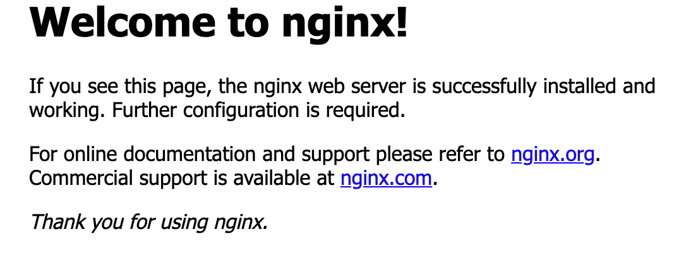
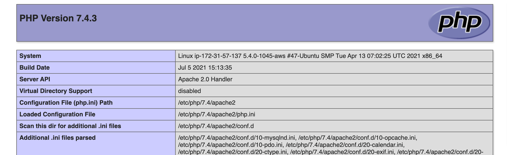

# DEPLOY LEMP STACK APPLICATION ON AWS

___

> Step 1

- Install NGINX Server 
- __sudo__ apt update & __sudo__ apt install nginx

- Verify NGINX is running 
-   __sudo__ systemctl status nginx
- if color is green, than everything is installed corrected.

-   Go to the security group and allow port 80 and then access nginx server locally and from the Internet.

1.  Access it locally in our Ubuntu shell, run:

- __curl__ http://localhost:80 or curl http://127.0.0.1:80

2.  Access it from the internet, open a web browser and type http://Public-IP-Address:80

- 


- To get the public IP Address, use 
- __curl__ -s http://169.254.169.254/latest/meta-data/public-ipv4

> Step 2 
- Install MySql Server

- __sudo__ apt install mysql-server  

- Run a security script that comes pre-installed with MySQL  
__sudo__ mysql_secure_installation  
You can enable VALIDATE PASSWORD PLUGIN by pressing Y or press other keys to continue without enabling it.  
- Login to MySQL console  
__sudo__ mysql. Run __exit__ to exit out of the mysql console.

> Step 3 
- Install PHP

- __sudo__ apt install php-fpm php-mysql
- When prompted, type Y and press ENTER to confirm installation.

> Step 4

- Configure NGINX to use PHP processor.

- Nginx has one server block enabled by default and is configured to serve documents out of a directory at /var/www/html. But to serve multiple sites,  create a directory structure within /var/ww ,leaving /var/www/html in place as the default directory to be served if a client request does not match any other sites. 

- Create the root web directory for your_domain as follows:

- __sudo__ mkdir /var/www/projectLEMP

- Next, assign ownership of the directory with the $USER environment variable, which will reference your current system user:

- __sudo__ chown -R $USER:$USER /var/www/projectLEMP

- Open a new configuration file in Nginx’s sites-available directory

- __sudo__ nano /etc/nginx/sites-available/projectLEMP

- Paste in the following configuration

```
#/etc/nginx/sites-available/projectLEMP

server {
    listen 80;
    server_name projectLEMP www.projectLEMP;
    root /var/www/projectLEMP;

    index index.html index.htm index.php;

    location / {
        try_files $uri $uri/ =404;
    }

    location ~ \.php$ {
        include snippets/fastcgi-php.conf;
        fastcgi_pass unix:/var/run/php/php7.4-fpm.sock;
     }

    location ~ /\.ht {
        deny all;
    }

}
```

- Save and Close. If you’re using nano, you can do so by typing CTRL+X and then y and ENTER to confirm.

- Activate the configuration by linking to the config file from Nginx’s sites-enabled directory. Run:

- __sudo__ ln -s /etc/nginx/sites-available/projectLEMP /etc/nginx/sites-enabled/

- This will tell Nginx to use the configuration next time it is reloaded. You can test your configuration for syntax errors by typing:

- __sudo__ nginx -t

- If any errors are reported, go back to your configuration file to review its contents before continuing.

- Disable default Nginx host that is currently configured to listen on port 80, for this run:

- __sudo__ unlink /etc/nginx/sites-enabled/default

- Reload NGINX 
- __sudo__ systemctl reload nginx

- The new website is now active, but the web root /var/www/projectLEMP is still empty. Create an index.html file in that location so that we can test that your new server block works as expected:

```
sudo echo 'Hello LEMP from hostname' $(curl -s http://169.254.169.254/latest/meta-data/public-hostname) 'with public IP' $(curl -s http://169.254.169.254/latest/meta-data/public-ipv4) > /var/www/projectLEMP/index.html
```

- Go to browser and type http://Public-DNS-Name:80 

-  LEMP stack is now fully configured

> Step 5

- Testing PHP with Nginx

- At this point,  LAMP stack is completely installed and fully operational. Test it to validate that Nginx can correctly hand .php files off to your PHP processor. Do this by creating a test PHP file in the document root. Open a new file called info.php within the document root in the text editor:

- __sudo__ nano /var/www/projectLEMP/info.php
- Paste the following PHP code
```
<?php
phpinfo();
```

- Access the page on the web browser by typing http://`server_domain_or_IP`/info.php

- 

- After checking the relevant information about the PHP server through that page, it’s best to remove the file  created as it contains sensitive information about the PHP environment and the Ubuntu server. The file can always be generated later. Use rm to remove that file:

- __sudo__ rm /var/www/your_domain/info.php


> Step 6

- Retrieving Data from MYSQL Database with PHP.

- First, connect to the MySQL console using the root account:
- __sudo__ mysql

- Create a database and User.

- CREATE DATABASE `demo_database`;
- CREATE USER 'demo_user'@'%' IDENTIFIED WITH mysql_native_password BY '@password1';

- NB: Specify own password.

- Give the user permission over the database. 
- GRANT ALL ON demo_database.* TO 'demo_user'@'%';

- This will give the demo_user user full privileges over the demo_database database, while preventing this user from creating or modifying other databases on your server. Now exit the MySQL shell with: `exit`.

- Check if the user has proper permissions and follow the prompt to input the password set for the user. The -p flag indicates user password.

- mysql -u demo_user -p

- Inside the MYSQL Shell, type `SHOW DATABASES;`  . The database will be outputed


